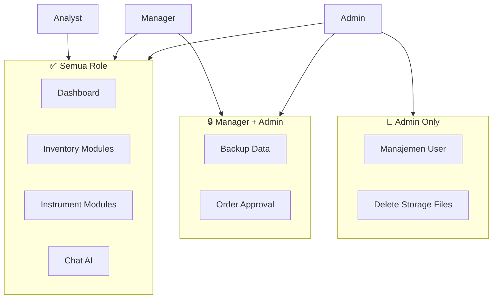
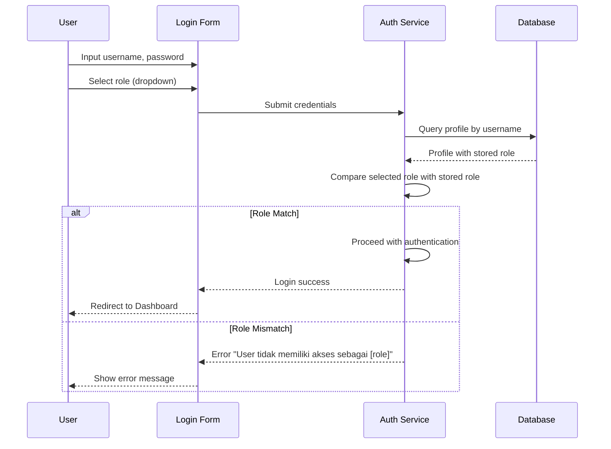

# Hak Akses dan Kontrol LabFlow Assets

Dokumen ini menjelaskan sistem Role-Based Access Control (RBAC) yang diimplementasikan dalam aplikasi.

---

## 1. Daftar Role

Aplikasi LabFlow Assets memiliki 3 level role pengguna:

| Role | Deskripsi | Warna Badge |
|------|-----------|-------------|
| **Admin** | Administrator sistem dengan akses penuh | 🔴 Merah |
| **Manager** | Manajer laboratorium dengan akses approval | 🔵 Biru |
| **Analyst** | Analis laboratorium dengan akses operasional | 🟢 Hijau |

---

## 2. Matriks Akses Menu



### Tabel Akses Menu

| Menu | Admin | Manager | Analyst |
|------|:-----:|:-------:|:-------:|
| Dashboard | ✅ | ✅ | ✅ |
| Katalog Reagen | ✅ | ✅ | ✅ |
| Katalog Standard | ✅ | ✅ | ✅ |
| Katalog Barang | ✅ | ✅ | ✅ |
| Gudang Kimia | ✅ | ✅ | ✅ |
| Gudang Barang | ✅ | ✅ | ✅ |
| Log Penggunaan | ✅ | ✅ | ✅ |
| Pesanan | ✅ | ✅ | ✅ |
| Training Usage | ✅ | ✅ | ✅ |
| Database Instrumen | ✅ | ✅ | ✅ |
| Log Kalibrasi | ✅ | ✅ | ✅ |
| Maintenance | ✅ | ✅ | ✅ |
| Chat AI | ✅ | ✅ | ✅ |
| **Backup Data** | ✅ | ✅ | ❌ |
| **Manajemen User** | ✅ | ❌ | ❌ |

---

## 3. Matriks Akses Fungsional

### 3.1 Inventory Operations

| Operasi | Admin | Manager | Analyst |
|---------|:-----:|:-------:|:-------:|
| Lihat katalog | ✅ | ✅ | ✅ |
| Tambah item katalog | ✅ | ✅ | ✅ |
| Edit item katalog | ✅ | ✅ | ✅ |
| Hapus item katalog | ✅ | ✅ | ✅ |
| Lihat gudang | ✅ | ✅ | ✅ |
| Terima barang | ✅ | ✅ | ✅ |
| Update stok | ✅ | ✅ | ✅ |
| Catat penggunaan | ✅ | ✅ | ✅ |

### 3.2 Order Management

| Operasi | Admin | Manager | Analyst |
|---------|:-----:|:-------:|:-------:|
| Lihat semua pesanan | ✅ | ✅ | ✅ |
| Buat pesanan baru | ✅ | ✅ | ✅ |
| **Approve pesanan** | ✅ | ✅ | ❌ |
| **Reject pesanan** | ✅ | ✅ | ❌ |
| Terima barang pesanan | ✅ | ✅ | ✅ |
| Cancel pesanan sendiri | ✅ | ✅ | ✅ |

### 3.3 Instrument Operations

| Operasi | Admin | Manager | Analyst |
|---------|:-----:|:-------:|:-------:|
| Lihat instrumen | ✅ | ✅ | ✅ |
| Tambah instrumen | ✅ | ✅ | ✅ |
| Edit instrumen | ✅ | ✅ | ✅ |
| Hapus instrumen | ✅ | ✅ | ✅ |
| Input kalibrasi | ✅ | ✅ | ✅ |
| Input maintenance | ✅ | ✅ | ✅ |

### 3.4 User Management

| Operasi | Admin | Manager | Analyst |
|---------|:-----:|:-------:|:-------:|
| Lihat daftar user | ✅ | ❌ | ❌ |
| Tambah user baru | ✅ | ❌ | ❌ |
| Edit user | ✅ | ❌ | ❌ |
| Hapus user | ✅ | ❌ | ❌ |
| Reset password | ✅ | ❌ | ❌ |

### 3.5 File Storage

| Operasi | Admin | Manager | Analyst |
|---------|:-----:|:-------:|:-------:|
| Upload dokumen | ✅ | ✅ | ✅ |
| Lihat dokumen | ✅ | ✅ | ✅ |
| Update dokumen sendiri | ✅ | ✅ | ✅ |
| **Hapus dokumen** | ✅ | ❌ | ❌ |
| Upload foto | ✅ | ✅ | ✅ |
| Lihat foto (public) | ✅ | ✅ | ✅ |
| **Hapus foto** | ✅ | ❌ | ❌ |

---

## 4. Implementasi Teknis

### 4.1 Frontend Access Control

Kontrol akses di sidebar menggunakan conditional rendering:

```tsx
// Admin menu - hanya tampil untuk admin
{user?.role === 'admin' && (
    <SidebarMenuItem>
        <Link href="/admin/users">Manajemen User</Link>
    </SidebarMenuItem>
)}

// Manager + Admin menu
{(user?.role === 'admin' || user?.role === 'manager') && (
    <SidebarMenuItem>
        <Link href="/admin/backup">Backup Data</Link>
    </SidebarMenuItem>
)}
```

### 4.2 API Route Protection

Contoh proteksi endpoint di API:

```typescript
// Check if user is admin or manager for order approval
const profile = await db.query.profiles.findFirst({
    where: eq(schema.profiles.id, user.id),
});

if (!profile || !['admin', 'manager'].includes(profile.role)) {
    return Response.json(
        { error: 'Unauthorized - requires manager or admin role' },
        { status: 403 }
    );
}
```

### 4.3 Database Row Level Security (RLS)

Policies yang diterapkan di PostgreSQL:

```sql
-- Hanya manager/admin yang bisa update orders (approval)
CREATE POLICY "Manager/Admin can update orders" ON orders
  FOR UPDATE TO authenticated
  USING (
    EXISTS (
      SELECT 1 FROM profiles 
      WHERE id = auth.uid() 
      AND role IN ('manager', 'admin')
    )
  );

-- Hanya admin yang bisa manage profiles
CREATE POLICY "Admin can manage profiles" ON profiles
  FOR ALL TO authenticated
  USING (
    EXISTS (
      SELECT 1 FROM profiles 
      WHERE id = auth.uid() 
      AND role = 'admin'
    )
  );
```

---

## 5. Alur Login dengan Role



### Aturan Login:
1. User harus memilih role yang sesuai dengan yang terdaftar di database
2. Tidak bisa login sebagai role yang berbeda dari yang didaftarkan
3. Session menyimpan informasi role untuk authorization

---

## 6. Rekomendasi Keamanan

> [!IMPORTANT]
> **Best Practices untuk Manajemen Akses**

1. **Principle of Least Privilege**: Berikan role minimum yang diperlukan untuk tugas user
2. **Regular Audit**: Review akses user secara berkala
3. **Strong Passwords**: Gunakan password yang kuat untuk semua akun
4. **Session Timeout**: Session akan expired jika idle terlalu lama

### Role Assignment Guidelines:

| Posisi Pekerjaan | Recommended Role |
|------------------|------------------|
| IT Administrator | Admin |
| Lab Manager / Supervisor | Manager |
| Quality Manager | Manager |
| Lab Technician | Analyst |
| Research Analyst | Analyst |
| Intern / Trainee | Analyst |

---

*Dokumen ini dibuat pada: 3 Januari 2026*
