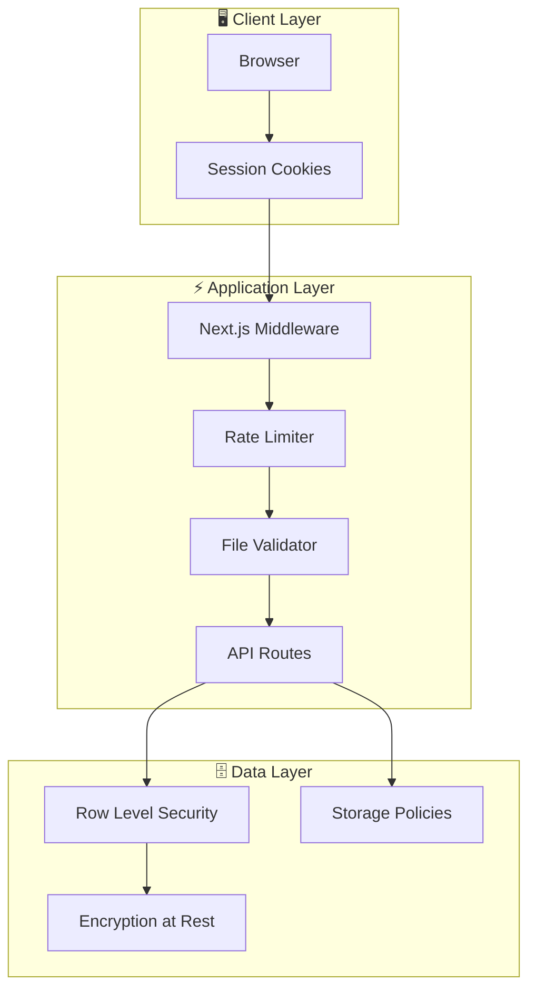
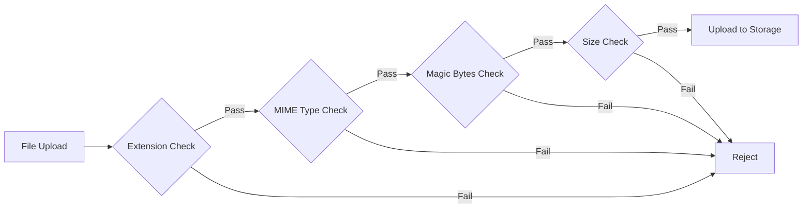

# Dokumentasi Keamanan LabFlow Assets

Dokumen ini menjelaskan implementasi keamanan yang diterapkan dalam aplikasi LabFlow Assets LIMS.

---

## 1. Gambaran Keamanan



---

## 2. Authentication & Session Management

### 2.1 Autentikasi

| Aspek | Implementasi |
|-------|--------------|
| **Provider** | Supabase Auth |
| **Method** | Email/Password |
| **Session Type** | Cookie-based (HttpOnly) |
| **Token Format** | JWT |

### 2.2 Session Protection

```typescript
// Middleware melindungi semua routes kecuali yang dikecualikan
export const config = {
    matcher: [
        "/((?!_next/static|_next/image|favicon.ico|api/auth|.*\\.(?:svg|png|jpg|jpeg|gif|webp)$).*)",
    ],
}
```

**Protected Resources**:
- ✅ Semua halaman dashboard
- ✅ Semua API endpoints (kecuali `/api/auth`)
- ✅ Semua file asset (dengan auth header)

**Excluded from Auth**:
- `/login` - Halaman login
- `/api/auth/*` - Auth endpoints
- Static files (images, fonts, etc.)

### 2.3 Password Security

| Aspek | Implementasi |
|-------|--------------|
| **Hashing** | bcrypt via Supabase Auth |
| **Salt Rounds** | Default (10) |
| **Storage** | Supabase auth.users table |

---

## 3. Rate Limiting

### 3.1 Implementasi Token Bucket Algorithm

```typescript
// Konfigurasi Rate Limit
const RATE_LIMIT_CONFIGS = {
    chat: {
        maxTokens: 10,          // 10 requests max
        refillRate: 10,         // Refill semua token
        refillInterval: 60000,  // Per menit
    },
    upload: {
        maxTokens: 20,          // 20 requests max
        refillRate: 20,
        refillInterval: 60000,
    },
    default: {
        maxTokens: 100,         // 100 requests max
        refillRate: 100,
        refillInterval: 60000,
    },
}
```

### 3.2 Endpoint Limits

| Endpoint | Limit | Window | Response Headers |
|----------|-------|--------|------------------|
| `/api/chat` | 10 req | 1 menit | `X-RateLimit-*` |
| `/api/upload` | 20 req | 1 menit | `X-RateLimit-*` |
| Others | 100 req | 1 menit | `X-RateLimit-*` |

### 3.3 Client Identification

```typescript
// Priority order for client IP detection
1. X-Forwarded-For header (Vercel/Cloudflare)
2. X-Real-IP header
3. Fallback random ID
```

### 3.4 Rate Limit Response Headers

```
X-RateLimit-Limit: 10
X-RateLimit-Remaining: 7
X-RateLimit-Reset: 45
```

---

## 4. File Upload Security

### 4.1 File Validation Layers



### 4.2 Allowed File Types

| Category | Extensions | MIME Types | Max Size |
|----------|------------|------------|----------|
| **Images** | .jpg, .jpeg, .png, .gif, .webp | image/* | 5MB |
| **Documents** | .pdf | application/pdf | 10MB |
| **Office** | .doc, .docx | application/msword, application/vnd.openxmlformats-* | 10MB |

### 4.3 Magic Bytes Validation

Validasi file berdasarkan magic bytes (file signature):

| File Type | Magic Bytes (Hex) |
|-----------|-------------------|
| JPEG | `FF D8 FF` |
| PNG | `89 50 4E 47 0D 0A 1A 0A` |
| GIF87a | `47 49 46 38 37 61` |
| GIF89a | `47 49 46 38 39 61` |
| PDF | `25 50 44 46` (%PDF) |
| DOCX | `50 4B 03 04` (ZIP) |
| DOC | `D0 CF 11 E0 A1 B1 1A E1` (OLE) |

### 4.4 Filename Sanitization

```typescript
// Mencegah path traversal attacks
function sanitizeFilename(filename: string): string {
    return filename
        .replace(/[\/\\]/g, '_')      // Remove path separators
        .replace(/\x00/g, '')         // Remove null bytes
        .replace(/\.\./g, '_')        // Remove directory traversal
        .trim();
}
```

---

## 5. Row Level Security (RLS)

### 5.1 Policy Overview

| Table | SELECT | INSERT | UPDATE | DELETE |
|-------|:------:|:------:|:------:|:------:|
| profiles | Auth ✅ | Admin | Admin | Admin |
| reagent_catalog | Auth ✅ | Auth ✅ | Auth ✅ | Auth ✅ |
| standard_catalog | Auth ✅ | Auth ✅ | Auth ✅ | Auth ✅ |
| items_catalog | Auth ✅ | Auth ✅ | Auth ✅ | Auth ✅ |
| warehouse_chemicals | Auth ✅ | Auth ✅ | Auth ✅ | Auth ✅ |
| warehouse_items | Auth ✅ | Auth ✅ | Auth ✅ | Auth ✅ |
| orders | Auth ✅ | Auth ✅ | Manager/Admin | - |
| order_items | Auth ✅ | Auth ✅ | Auth ✅ | Auth ✅ |
| instruments | Auth ✅ | Auth ✅ | Auth ✅ | Auth ✅ |
| calibration_logs | Auth ✅ | Auth ✅ | Auth ✅ | Auth ✅ |
| maintenance_logs | Auth ✅ | Auth ✅ | Auth ✅ | Auth ✅ |

### 5.2 Critical Policies

```sql
-- Profile management - Admin only
CREATE POLICY "Admin can manage profiles" ON profiles
  FOR ALL TO authenticated
  USING (
    EXISTS (SELECT 1 FROM profiles WHERE id = auth.uid() AND role = 'admin')
  );

-- Order approval - Manager/Admin only
CREATE POLICY "Manager/Admin can update orders" ON orders
  FOR UPDATE TO authenticated
  USING (
    EXISTS (SELECT 1 FROM profiles WHERE id = auth.uid() AND role IN ('manager', 'admin'))
  );
```

---

## 6. Storage Security

### 6.1 Bucket Configuration

| Bucket | Visibility | Auth Required | Delete Access |
|--------|------------|---------------|---------------|
| `documents` | Private | Yes | Admin only |
| `images` | Public | No (view) / Yes (upload) | Admin only |
| `calibration-reports` | Private | Yes | Admin only |
| `maintenance-photos` | Private | Yes | Admin only |

### 6.2 Storage Policies

```sql
-- Contoh: Documents bucket
CREATE POLICY "Authenticated users can upload documents"
ON storage.objects FOR INSERT TO authenticated
WITH CHECK (bucket_id = 'documents');

CREATE POLICY "Admin can delete documents"
ON storage.objects FOR DELETE TO authenticated
USING (
  bucket_id = 'documents' AND
  EXISTS (SELECT 1 FROM public.profiles WHERE id = auth.uid() AND role = 'admin')
);
```

---

## 7. API Security

### 7.1 Webhook Authentication (n8n)

```typescript
// API Key header untuk webhook
const headers = {
    'Content-Type': 'application/json',
    'X-API-Key': process.env.N8N_WEBHOOK_API_KEY,
};
```

> [!IMPORTANT]
> Pastikan `N8N_WEBHOOK_API_KEY` dikonfigurasi di environment production

### 7.2 CORS & Headers

Next.js API routes default:
- CORS: Same-origin only
- Content-Type validation
- CSRF protection via cookies

### 7.3 Input Validation

Menggunakan Zod untuk validasi input:

```typescript
import { z } from 'zod';

const orderSchema = z.object({
    orderNumber: z.string().min(1).max(50),
    orderDate: z.string().datetime(),
    notes: z.string().optional(),
    items: z.array(orderItemSchema),
});
```

---

## 8. Environment Variables Security

### 8.1 Sensitive Variables

| Variable | Type | Exposure |
|----------|------|----------|
| `NEXT_PUBLIC_SUPABASE_URL` | Public | Client-safe |
| `NEXT_PUBLIC_SUPABASE_ANON_KEY` | Public | Client-safe, limited access |
| `SUPABASE_SERVICE_ROLE_KEY` | **Secret** | Server-only |
| `DATABASE_URL` | **Secret** | Server-only |
| `N8N_WEBHOOK_URL` | **Secret** | Server-only |
| `N8N_WEBHOOK_API_KEY` | **Secret** | Server-only |

### 8.2 Best Practices

> [!CAUTION]
> **Jangan pernah commit file `.env` ke Git repository!**

```gitignore
# .gitignore
.env
.env.local
.env.production
```

---

## 9. Backup Security

### 9.1 Manual Backup

- Akses: Manager + Admin only
- Format: ZIP berisi CSV files
- Transport: HTTPS download

### 9.2 Automated Backup

- Schedule: Monthly (1st day, 00:00 UTC)
- Storage: Supabase Storage (private bucket)
- Retention: Manual cleanup required

---

## 10. Security Checklist untuk Deployment

> [!WARNING]
> **Pastikan semua item berikut sebelum production deployment!**

### Pre-Deployment

- [ ] Semua environment variables production sudah di-set
- [ ] `SUPABASE_SERVICE_ROLE_KEY` berbeda dari development
- [ ] Database password kuat dan unik
- [ ] RLS policies sudah diaktifkan di Supabase
- [ ] Storage policies sudah dikonfigurasi

### Post-Deployment

- [ ] Test login dengan berbagai role
- [ ] Test rate limiting functionality
- [ ] Test file upload validation
- [ ] Verify RLS policies aktif
- [ ] Test backup functionality
- [ ] Review Vercel/Supabase logs untuk anomali

### Ongoing

- [ ] Monitor rate limit hits
- [ ] Review access logs bulanan
- [ ] Update dependencies secara berkala
- [ ] Rotate API keys jika diperlukan

---

## 11. Incident Response

### Jika Terjadi Security Breach:

1. **Immediate**: Rotate semua API keys dan service role keys
2. **Assess**: Review logs untuk scope of breach
3. **Contain**: Disable affected accounts jika perlu
4. **Recover**: Restore dari backup jika data compromised
5. **Report**: Dokumentasikan incident dan lessons learned

### Contact for Security Issues:

Laporkan vulnerability ke administrator sistem.

---

*Dokumen ini dibuat pada: 3 Januari 2026*
