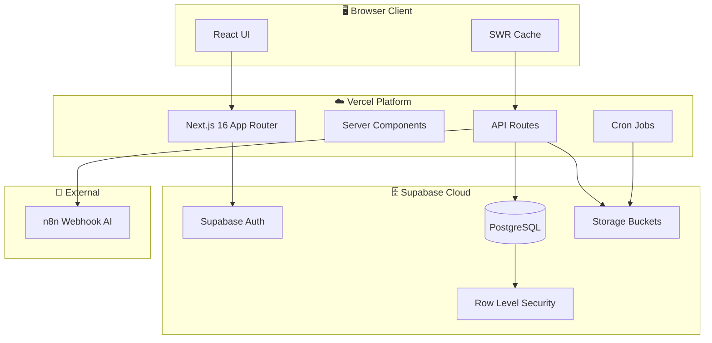
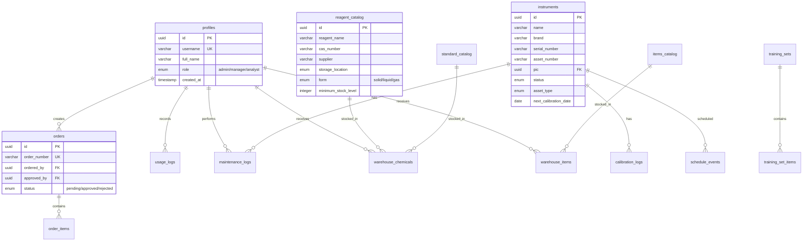
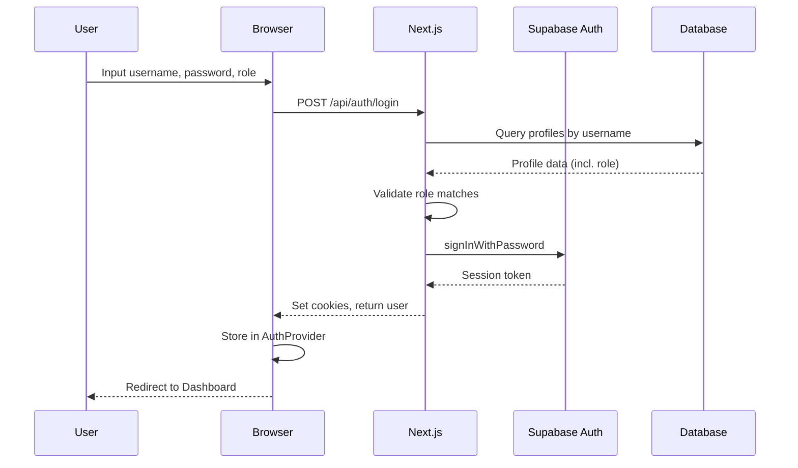
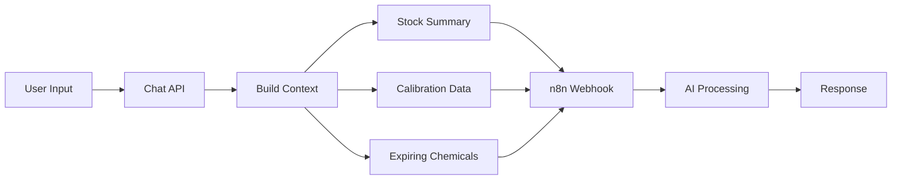
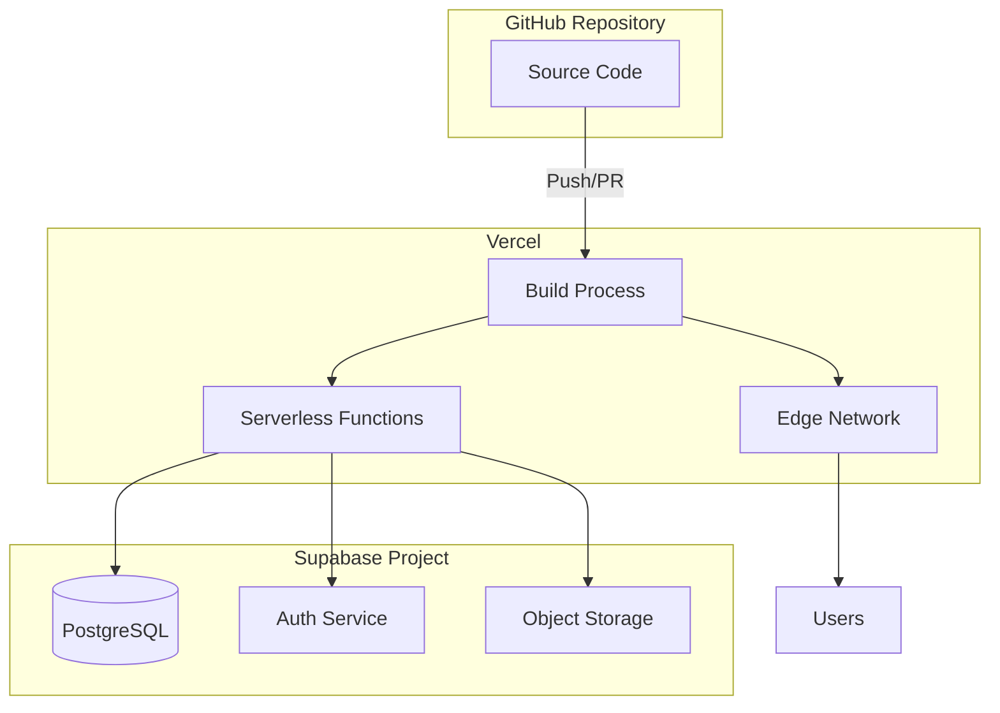

# Arsitektur Sistem LabFlow Assets

Dokumen ini menjelaskan arsitektur teknis aplikasi LabFlow Assets LIMS (Laboratory Information Management System).

---

## 1. Gambaran Umum

LabFlow Assets adalah aplikasi web untuk mengelola inventaris laboratorium, termasuk reagen, standar, barang/consumable, serta instrumen dan jadwal kalibrasi.



---

## 2. Technology Stack

| Layer | Teknologi | Versi | Fungsi |
|-------|-----------|-------|--------|
| **Frontend** | Next.js | 16.1.1 | Framework React dengan App Router |
| **UI Components** | Radix UI + Tailwind CSS | v4 | Komponen UI yang accessible |
| **State Management** | SWR | 2.3.8 | Caching dan revalidasi data |
| **Backend** | Next.js API Routes | - | RESTful API endpoints |
| **Database** | PostgreSQL (Supabase) | - | Database relasional |
| **ORM** | Drizzle ORM | 0.45.1 | Type-safe database queries |
| **Authentication** | Supabase Auth | SSR | Session-based authentication |
| **Storage** | Supabase Storage | - | File upload (dokumen, foto) |
| **Charts** | Recharts | 3.6.0 | Visualisasi data dashboard |
| **Deployment** | Vercel | - | Hosting dan CI/CD |

---

## 3. Struktur Database

### 3.1 Entity Relationship Diagram



### 3.2 Daftar Tabel

| No | Tabel | Deskripsi |
|----|-------|-----------|
| 1 | `profiles` | Data user (extends Supabase auth.users) |
| 2 | `instruments` | Database instrumen laboratorium |
| 3 | `calibration_logs` | Log kalibrasi instrumen |
| 4 | `maintenance_logs` | Log maintenance/perbaikan instrumen |
| 5 | `schedule_events` | Event kalender (kalibrasi, maintenance, expired) |
| 6 | `reagent_catalog` | Katalog master reagen |
| 7 | `standard_catalog` | Katalog master standar |
| 8 | `items_catalog` | Katalog master barang/consumable |
| 9 | `warehouse_chemicals` | Stok gudang untuk reagen & standar |
| 10 | `warehouse_items` | Stok gudang untuk barang |
| 11 | `orders` | Pesanan pembelian |
| 12 | `order_items` | Detail item pesanan |
| 13 | `usage_logs` | Log penggunaan inventaris |
| 14 | `training_sets` | Set alat untuk training |
| 15 | `training_set_items` | Item dalam training set |

---

## 4. Struktur API Routes

```
/api
├── /auth
│   ├── /login          POST - Login user
│   ├── /logout         POST - Logout user
│   └── /session        GET  - Get current session
├── /dashboard          GET  - Dashboard data aggregation
├── /schedule           GET  - Calendar events
├── /chat               POST - AI Chat via n8n webhook
├── /upload             POST - File upload handler
├── /instruments
│   ├── GET/POST        - List/Create instruments
│   ├── /[id]           GET/PUT/DELETE - Instrument CRUD
│   ├── /calibration    GET/POST - Calibration logs
│   └── /maintenance    GET/POST - Maintenance logs
├── /inventory
│   ├── /reagents       CRUD - Katalog reagen
│   ├── /standards      CRUD - Katalog standar
│   ├── /items          CRUD - Katalog barang
│   ├── /warehouse-chemicals  CRUD - Stok kimia
│   ├── /warehouse-items      CRUD - Stok barang
│   ├── /orders         CRUD - Pesanan
│   ├── /usage-logs     CRUD - Log penggunaan
│   └── /training       CRUD - Training sets
├── /admin
│   ├── /users          CRUD - User management (admin only)
│   └── /backup         GET  - Manual backup download
├── /cron
│   └── /backup         GET  - Automated monthly backup
└── /support            POST - Webhook support
```

---

## 5. Alur Autentikasi



### Poin Penting:
1. **Username-based login**: Email diformat sebagai `username@labmania.local`
2. **Role validation**: Role dipilih saat login harus match dengan database
3. **Session management**: Menggunakan Supabase SSR untuk cookie-based sessions
4. **Middleware protection**: Semua routes dilindungi middleware kecuali `/login` dan `/api/auth`

---

## 6. Integrasi External

### 6.1 n8n Webhook (Chat AI)



Chat AI mengirim konteks database real-time (stok, kalibrasi, expired) ke n8n webhook untuk diproses oleh AI.

### 6.2 Supabase Storage

| Bucket | Tipe | Max Size | Allowed Types |
|--------|------|----------|---------------|
| `documents` | Private | 10MB | PDF, DOC, DOCX |
| `images` | Public | 5MB | JPEG, PNG, WebP, GIF |
| `calibration-reports` | Private | 10MB | PDF |
| `maintenance-photos` | Private | 5MB | JPEG, PNG, WebP |

---

## 7. Scheduled Tasks (Cron)

| Job | Schedule | Path | Fungsi |
|-----|----------|------|--------|
| Monthly Backup | 1st of month @ 00:00 UTC | `/api/cron/backup` | Auto-backup database ke Supabase Storage |

---

## 8. Deployment Architecture



### Environment Variables Required:
```env
NEXT_PUBLIC_SUPABASE_URL=https://xxx.supabase.co
NEXT_PUBLIC_SUPABASE_ANON_KEY=eyJ...
SUPABASE_SERVICE_ROLE_KEY=eyJ...
DATABASE_URL=postgresql://...
N8N_WEBHOOK_URL=https://...
N8N_WEBHOOK_API_KEY=xxx
```

---

## 9. Performance Optimizations

1. **SWR Caching**: Dashboard data di-cache 60 detik dengan deduplication
2. **Lazy Loading Charts**: Recharts di-import secara dinamis
3. **Database Indexes**: Index pada kolom yang sering di-query
4. **Session Caching**: Session di-cache di AuthProvider untuk menghindari re-fetch

---

*Dokumen ini dibuat pada: 3 Januari 2026*
